#  LAB 2- Bayesian learning: GAUSSIAN MIXTURES 
Imad El Hanafi  

# Part 1. Preliminaries

We start first by importing all our auxiliary functions implemented in *EL-HanafiImad_functions.R* and all necessary libraries.


```r
#Load libraries and the source for the functions
library(MASS)
library(abind)
library(mnormt)
library(LaplacesDemon)
library(coda)
#Load my functions
source("EL-HanafiImad_functions.R")

```


We recall the Gaussian mixture model defined on $\mathbb{R^d}$. The data $X = (X_1,...,X_N)$ is assumed i.i.d with density 
$$
f(x|\rho_{1:k},\mu_{1:k},\Sigma_{1:k}) = \sum_{j=1}^{K}{\rho_j \mathcal{N}(x|\mu_j,\Sigma_j)}
$$

Where $\rho_j$ sums to 1 and $\mu_j$ and $\Sigma_j$ are are respectively the center and the covariance matrix of component j. This model can be rewritten using hidden variables:

\[ \xi_{i} = Multinomial(\rho) \]
\[ \mathcal{L}(X_{i}|\xi_{i}= j) = \mathcal{N}(\mu_{j},\Sigma_{j}) \]
Tha paramter for the Gaussian mixture is then $\Theta = (\rho_{1:k},\mu_{1:k},\Sigma_{1:k})$.

We start by setting the dimension of our data and the number of clusters $K$. We set the parameters $\rho_{1:k},\mu_{1:k},\Sigma_{1:k}$ and the we generate for each cluster a multinormal with $\mu_j$ and $\Sigma_j$.


```r
d=2 ## Dimension
K <- 3 ## number of mixture components
N <- 500 ## Sample size
set.seed(1)
p <- c(3/10, 2/10, 5/10) 
NN <- rmultinom(n = 1, size = N, prob = p)
Mu <- rbind(c(-1,-1), c(0,1), c(1, -1))
X <- matrix(ncol = d, nrow = 0)
Sigma <- array(dim = c(2,2,K))
for(j in 1:K){
    Sigma[,,j] <- rwishart(nu = 5, S = 0.05*diag(d))
}  
for(j in 1:K){
    X <- rbind(X, mvrnorm(n=NN[j], mu = Mu[j,], Sigma=Sigma[,,j])) 
}

#' labs: vector of labels
labs <- rep(0,N)
count=1
for(j in 1:K)
{
    labs[count:(count+NN[j]-1)] <- j
    count=count + NN[j]
}
```

We plot then the generated data as follows:


```r
plot(X[,1], X[,2], col=labs,xlab = "X1", ylab = "X2", title("plot of simulated data"))
```

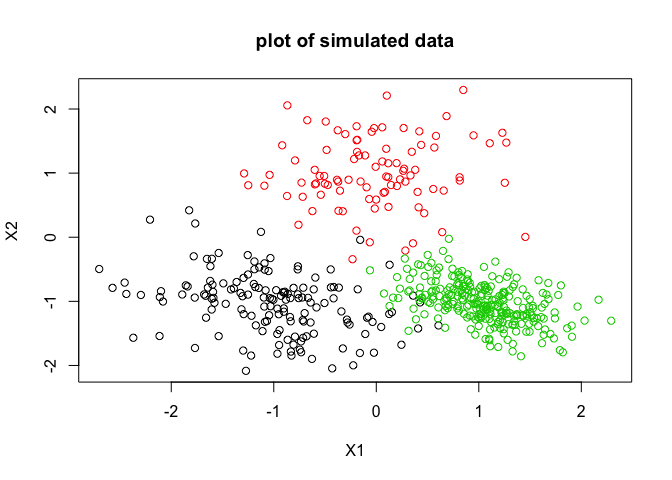<!-- -->


# Part 2 : EM Algorithm

## Maximum Likelihood estimate 

In this part we will implement the EM algorithm for Gaussian mixtures. This consist of mainly two steps:

- **E-step:** Where we evaluate the responsibilities of each cluster using the current parameter values 

$$
\gamma_{nk}=\frac{{\rho_{k}}\mathcal{N}(X_{n}|{\mu_{k}},{\Sigma_{k}})}{\sum_{j=1}^{K}{\rho_{j}}\mathcal{N}(X_{n}|{\mu_{j}},{\Sigma_{j}})} \
$$

- **M-step:** Re-estimate the parameters using the current responsibilities

$$ {\mu_{k}}=\frac{1}{N_{k}}\sum_{n=1}^{n=N} \gamma_{nk}X_{n} $$
$$ {\Sigma_{k}}=\frac{1}{N_{k}}\sum_{n=1}^{n=N} \gamma_{nk}(X_{n}- {\mu_{k}})(X_{n}- \mu_{k})^{T} $$
$$ {\rho_{k}}=\frac{N_{k}}{N} $$


Where we define $N_{k}$ as 
$$ N_{k} = \sum_{n=1}^{n=N} \gamma_{nk} $$

These equations are the coupled equations that are satisfied by the maximum likelihood estimates. This allows us to evaluate the log-likelihood 
$$ \ln f(x|,\rho,\mu,\Sigma) =  \sum_{n=1}^{N} \ln \sum_{j=1}^{K} \rho_j \mathcal{N}(x_n|\mu_j,\Sigma_j)$$ 
and check the convergence with a defined tolerance.

The functions that do these tasks are implemented in **EL-HanafiImad_functions.R** under the names : *estep, mstep, emalgo*.

## EM Tests

To test our EM-algorithm, we set a number of clusters that we are looking (Kfit), we run the algorithm and then we plot the results.

- $Kfit = 4$


```r
#########################'
#' 2. EM  
#########################' 

#' Run EM
Kfit <- 4 ## try with Kfit= 2,3,4,5 ...
outputem <- emalgo(x=X,k=Kfit, tol=1e-6)

#' inspect the objective function (stopping criterion)
length(outputem$objective)
```

```
## [1] 262
```

```r
#' Plot the (labelled) data 
plot(X[,1], X[,2], col = labs, pch = 19,main = "kfit = 4")

#' Add the starting points (from kmeans) to the plot
Init <-  initem(X,Kfit)
points(Init$Mu[,1],Init$Mu[,2], col="orange",pch=18,cex=5)
#' Add the centers from EM
points(outputem$last$Mu[,1],outputem$last$Mu[,2], col="blue",pch=18,cex=5)
#' Add the true centers
points(Mu[,1],Mu[,2], col="black",pch=3,cex=5) 

#' Draw 1.64 sd level sets 
for(j in 1:Kfit){
    ellips <- draw_sd(outputem$last$Mu[j,], outputem$last$Sigma[,,j])
    lines(ellips[1,], ellips[2,], col = 'purple')
}

for(j in 1:K){
    ellips <- draw_sd(Mu[j,], Sigma[,,j])
    lines(ellips[1,], ellips[2,], col='black')
}
## Add a legend

legend("topleft", c("K-means centers (initiating)", "EM centers", "True centers",
                    "EM 1.64 sd lvl","True 1.64 sd lvl ") ,col = c("orange", "Blue",
                    "black",'purple','black'),lty = c(NA, NA, NA,1,1), 
                    pch = c(18, 18, 3,NA,NA),cex = 0.5)
```

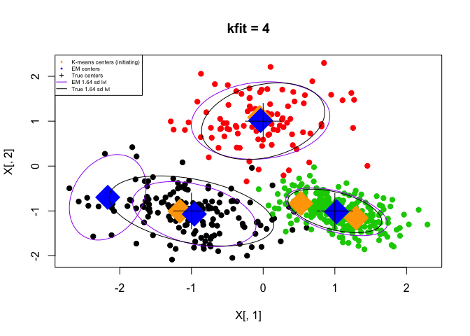<!-- -->

- $Kfit = 5$

We test the EM algorithm with kfit = 5 and we get the following results.


```r
#########################'
#' 2. EM  
#########################' 

#' Run EM
Kfit2 <- 5 ## try with Kfit= 2,3,4,5 ...
outputem2 <- emalgo(x=X,k=Kfit2, tol=1e-6)

#' inspect the objective function (stopping criterion)
length(outputem2$objective)
```

```
## [1] 388
```

```r
#' Plot the (labelled) data 
plot(X[,1], X[,2], col = labs, pch = 19, main = "Kfit = 5")

#' Add the starting points (from kmeans) to the plot
Init <-  initem(X,Kfit2)
points(Init$Mu[,1],Init$Mu[,2], col="orange",pch=18,cex=5)
#' Add the centers from EM
points(outputem2$last$Mu[,1],outputem2$last$Mu[,2], col="blue",pch=18,cex=5)
#' Add the true centers
points(Mu[,1],Mu[,2], col="black",pch=3,cex=5) 

#' Draw 1.64 sd level sets 
for(j in 1:Kfit2){
    ellips <- draw_sd(outputem2$last$Mu[j,], outputem2$last$Sigma[,,j])
    lines(ellips[1,], ellips[2,], col = 'purple')
}

for(j in 1:K){
    ellips <- draw_sd(Mu[j,], Sigma[,,j])
    lines(ellips[1,], ellips[2,], col='black')
}
## Add a legend

legend("topleft", c("K-means centers (initiating)", "EM centers", "True centers",
                    "EM 1.64 sd lvl","True 1.64 sd lvl ") ,col = c("orange", "Blue",
                    "black",'purple','black'),lty = c(NA, NA, NA,1,1), 
                    pch = c(18, 18, 3,NA,NA),cex = 0.5)
```

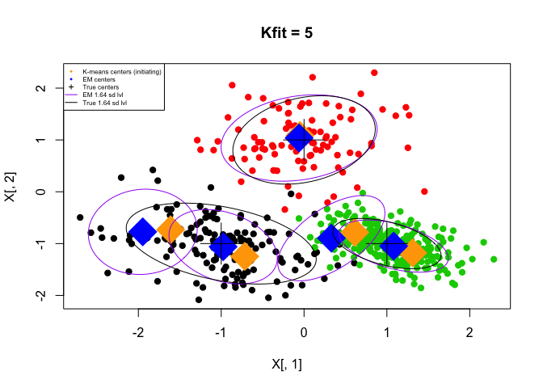<!-- -->


**Remarks:** 
One can see that *Kfit* the input parameter for the EM algorithm is crucial. The number of components/clusters is not automatically recovered.
With *kfit = 4*, the estimated parameters for the green and red clusters fit well, while the black cluster is devided into two clusters. 
In real life data, we don't know the number of clusters (an input for the EM algorithm), one can guess it from the parameters of estimated clusters. 

We show here the last parameters in the EM:


```r
# Show results of EM algorithm with kfit = 4
outputem$last$Mu
```

```
##             [,1]       [,2]
## [1,] -2.16815373 -0.6964458
## [2,] -0.96047761 -1.0707783
## [3,]  1.02411925 -1.0190586
## [4,] -0.03610273  1.0151320
```

```r
outputem$last$Sigma
```

```
## , , 1
## 
##            [,1]       [,2]
## [1,] 0.10658459 0.04727624
## [2,] 0.04727624 0.33716413
## 
## , , 2
## 
##             [,1]        [,2]
## [1,]  0.27519307 -0.08322746
## [2,] -0.08322746  0.19504831
## 
## , , 3
## 
##             [,1]        [,2]
## [1,]  0.18683370 -0.06853296
## [2,] -0.06853296  0.10566025
## 
## , , 4
## 
##            [,1]       [,2]
## [1,] 0.34701302 0.03553341
## [2,] 0.03553341 0.27688391
```

```r
outputem$last$p
```

```
## [1] 0.02273959 0.26743349 0.52661820 0.18320872
```

In fact, we see that for the mixing coefficients $p$, the first value is negligable compared to the others so we can conclude that our data is generated from 3 mainly clusters.

- **Convergence:**

To check the convergence of the EM-algorithm we plot the evolution of the log-likelihood at each step. We can see clearly that we are maximizing the likelihood and it converges to a specefic value. But we should keep in mind that the EM-algorithm could be trapped at local maxima and consequently fails to reach global maxima.


```r
plot(outputem$objective,type='b',xlab = "Nb iteration",ylab = "Log-likelihood")
```

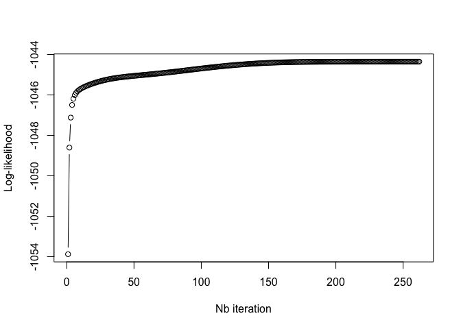<!-- -->

# Part 3 : Variational Bayes

## Variational Bayes approach

In this part we will use a variational approach using a mean field variational distribution:
$$ q(\rho, \mu_{1:k},\Lambda_{1:k}) = q(\rho) \prod_{j=1}^{k}{q(\mu_j,\Lambda_j)}$$

With $\Lambda_j =\Sigma_j^{-1}$. We choose a prior of a similar form, product of:

- A Dirichelet distribution on $\rho$ of parameter $\alpha_{0} = (\alpha_{0},...,\alpha_{0})$.
- A Gaussian-Whishart distributions on each pair $(\mu_{j},\Lambda_{j})$ where $\Lambda_j =\Sigma_j^{-1}$, with parameter $m_{0},\nu_{0},\beta_{0},W_{0}$ 

The variational posterior distribution is of the same form as the prior, with different
parameters $\alpha_{}^{*} = (\alpha_{1}^{*},...,\alpha_{k}^{*}),\beta_{}^{*}=(\beta_{1}^{*},...,\beta_{k}^{*}),m^{*} = (m_{1}^{*},...,m_{k}^{*}),\nu_{j}^{*}= (\nu_{1}^{*},...,\nu_{k}^{*}),W_{}^{*} = (W_{1}^{*},...,W_{k}^{*})$

We have that 
$$ \alpha_{j}^{*}=\alpha_{0}+N_{j}$$
$$ \beta_{j}^{*}=\beta_{0}+N_{j} $$
$$ m_{j}^{*}=\frac{1}{\beta_{j}^{*}}(\beta_{0}m_{0}+N_{j}\bar{X_{j}}) $$
$$ W_{j}^{* -1}= W_{0}^{-1}+N_{j}S_{j}+\frac{\beta_{0}N_{j}}{\beta_{0}+N_{j}}(\bar{X_{j}}-m_{0})(\bar{X_{j}}-m_{0})^{T}$$
$$ \nu_{j}^{*}=\nu_{0}+N_{j}$$

Where we define the following intermediate variables for calculations:

$$ln(p_{n,j})= \mathbb{E}[ln(\rho_{j})] + \frac{1}{2}\mathbb{E}[|\Lambda_{j}|] -\frac{D}{2}ln(2\pi)-\frac{1}{2}\mathbb{E}_{\mu_{j},\Lambda_{j}}[(X_{n}-\mu_{j})^{T}\Lambda_{j}(X_{n}-\mu_{j})]$$
$$ r_{n,j}=\frac{p_{n,j}}{\sum_{j=1}^{j=K}p_{n,j}}$$
$$ N_{j}=\sum_{n=1}^{n=N}r_{n,j}$$
$$\bar{X_{j}}=\frac{1}{N_{j}}\sum_{n=1}^{n=N}r_{n,j}X_{n}$$
$$ S_{j}=\frac{1}{N_{j}}\sum_{n=1}^{n=N}r_{n,j}(\bar{X_{j}}-X_{n})(\bar{X_{j}}-X_{n})^{T}$$

We implement this method in **EL-HanafiImad_functions.R**

## Tests of VB

We run our VB algorithm as it follows:


```r
#########################'
#' 3. VB
#########################' 
#' Bayesian model: 
#' p ~ dirichlet(alpha);  alpha = (alpha0, ... , alpha0)
#' [ xi | p ] ~ Multinomial(p)
#' [ mu_j | Lambda_j ] ~ Normal(m0, beta0 Lambda_j^(-1))
#' Lambda_j ~ Wishart(W0, nu0)
#' [ X| xi=j, mu, Lambda ] ~ Normal (mu_j, Lambda_j^(-1))


#' hyper-parameters : to be varied 
alpha0 <- 0.1
m0 <- rep(0,2) #c(50,50)
beta0 <- 0.1
W0 <- 1*diag(2)
nu0 <- 10

#' Run VB 
#'
seed <- 10
set.seed(seed)
outputvb <- vbalgo(x=X,k=Kfit, alpha0 = alpha0, W0inv = solve(W0),
                 nu0 = nu0, m0 = m0, beta0=beta0, tol=1e-6)

#' plot the lowerbound over iterations 
plot(outputvb$lowerbound,xlab = "Nb of itterations",ylab = "Log-lowerbound")
```

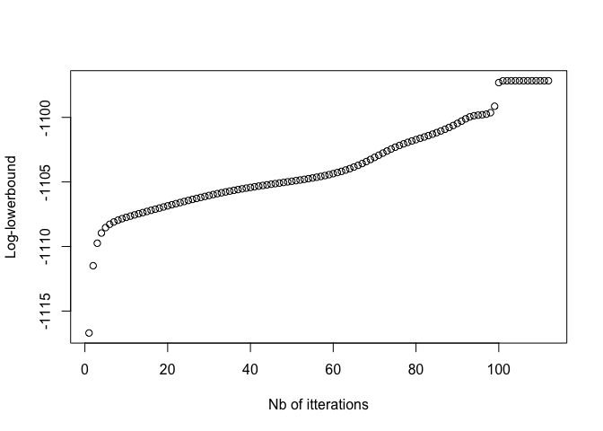<!-- -->

We show a summary of VB output. 


```r
# show a summary of VB's output
T <- ncol(outputvb$alphamat)
outputvb$alphamat[,T]
```

```
## [1] 262.67386  90.67938 146.94676   0.10000
```

```r
outputvb$Marray[,,T]
```

```
##               [,1]          [,2]
## [1,]  1.027284e+00 -1.016041e+00
## [2,] -4.395968e-02  1.028035e+00
## [3,] -1.038371e+00 -1.039631e+00
## [4,]  3.877258e-10 -4.759042e-10
```

## Estimation of parameter $\Theta$

Based on the posterior distribution and as a first approximation we consider the posterior expectancy of the parameters in the variational approximation. Since we know the distribution we get easly:

$$ \hat{\rho_{j, vb}}=\mathbb{E}_{q*}[\rho_{j}]=\frac{\alpha_{j}}{\sum_{k}\alpha_{k}} $$
$$ \hat{\mu_{j, vb}}=\mathbb{E}_{q*}[\mu_j]=m_j $$
$$ \hat{\Sigma_{j, vb}}=\mathbb{E}_{q*}[\Lambda_j]^{-1}=(\nu_j W_j)^{-1} $$

Where $(\alpha,\mu,\nu,W)$ are the last parameters of the variational posterior distribution (last iteration).

We plot then an overview of the VB estimation as in the EM algorithm.


```r
#' Visual summary of VB's output :
#' posterior expectancy of each parameter
p_vb <- outputvb$alphamat[,T]/(sum(outputvb$alphamat[,T]))
    ## (variational posterior expectancy of mixture weights)
Mu_vb <- outputvb$Marray[,,T]
    ## (variational posterior expectancy of mixture centers)
Sigma_vb <- array(dim=c(d,d,Kfit))
for(j in 1:Kfit){
    Sigma_vb[,,j] <- (outputvb$Winvarray[,,j,T]*(1/outputvb$Numat[j,T]))
    ## (variational posterior expectancy of mixture covariances)
}

## show the data, true centers and initial positions from K-means
#graphics.off()
plot(X[,1], X[,2], col=labs)
points(Mu[,1],Mu[,2], col="black",pch=8,cex=10*p) 
set.seed(seed)
Init <-  initem(X,Kfit)
points(Init$Mu[,1],Init$Mu[,2], col="orange",pch=18,cex = 10*Init$p)
## Add a  summary of the VB solution
nonneg <- which(p_vb>0.001)
for(j in nonneg){
    points(Mu_vb[j,1], Mu_vb[j,2], col="blue",
           pch=18,cex= 10 * p_vb[j])
    ellips <- draw_sd(mu = Mu_vb[j,], 
                      sigma = Sigma_vb[,,j])
    lines(ellips[1,], ellips[2,], col='blue')
}

legend("topleft", c("K-means centers (initiating)", "VB centers", "True centers",
                    "VB 1.64 sd lvl") ,col = c("orange", "Blue", "black",'blue'),
       lty = c(NA, NA, NA,1), pch = c(18, 18, 3,NA),cex = 0.5)
```

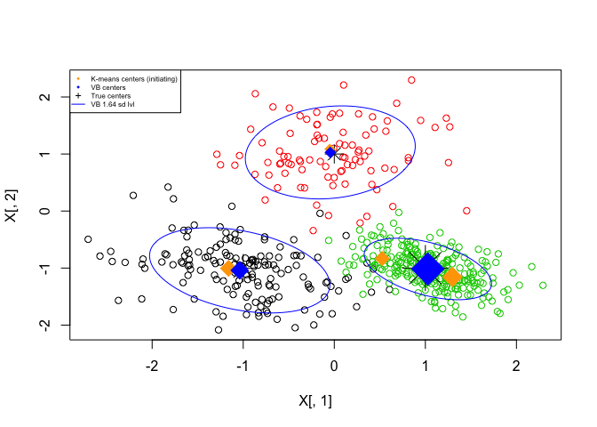<!-- -->

In this example we see that our model estimates 3 major clusters even if we set $Kfit$ to 4. This a major advantage of the Variational Bayes compared to the EM.
The 4th cluster has a very low $\alpha^*$ and then its estimated mixture parameter $\rho_4$ is very slow.

## Influence of the hyper-parameter $\alpha_0$

From the Dirichelet distribution we know that if $\alpha <1$, the prior favors solutions in which some of coefficients are zero (negligible weights for some clusters).
We can check that by ploting the estimator of weights $\hat\rho_{j, vb}$ and the real one $\rho_{j, vb}$ as a function of $\alpha_0$.


```r
alpha0_<-seq(0.01, 8, length.out=10)
p_vb_alpha<-matrix(0,ncol= Kfit, nrow= length(alpha0_))

seed <- 10
for (i in 1:length(alpha0_)){
  set.seed(seed)
  outputvb_test <- vbalgo(x=X,k=Kfit, alpha0 = alpha0_[i], 
                          W0inv = solve(W0), nu0 = nu0, m0 = m0, 
                          beta0=beta0, tol=1e-6)
  T <- ncol(outputvb_test$alphamat)
  p_vb_alpha[i,] <- outputvb_test$alphamat[,T] / sum(outputvb_test$alphamat[,T])
}

results = NULL
for (i in 1:Kfit){
  local = cbind(p_vb_alpha[,i],alpha0_)
  results <- rbind(results, local)
}

plot(results[,2],results[,1],ylim= range(p_vb_alpha[1,],p),xlab = "alpha_0 prior",
     ylab = "Weights")

legend("bottomright", c("True value of weight", "VB Expected Weights") ,
       col = c("black", "black"),lty = c(2,1), pch = c(NA,NA),cex = 0.4)

## To modifiy if we change Kfit
lines(alpha0_,p_vb_alpha[,1],type="l",col = 'red')
lines(alpha0_,p_vb_alpha[,2],type="l" ,col = 'blue')
lines(alpha0_,p_vb_alpha[,3],type="l" , col = 'black')
lines(alpha0_,p_vb_alpha[,4],type="l", col = 'orange')
lines(alpha0_,rep(p[1],nrow(p_vb_alpha)),col='black',lty=2)
lines(alpha0_,rep(p[2],nrow(p_vb_alpha)),col='blue',lty=2)
lines(alpha0_,rep(p[3],nrow(p_vb_alpha)),col='red',lty=2)
```

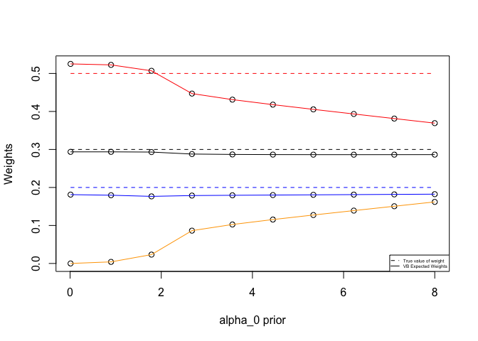<!-- -->

**Remarks:**

One can see that for values of $alpha <1$ the weight of the 4th cluster is close to zero and then we can conclude that our data has 3 main clusters.

Another interesting behavior is when $\alpha_0 -> \infty$ the expected weights converge to $1/K$. 


```r
alpha0_<-seq(0.01, 300, length.out=10)
p_vb_alpha<-matrix(0,ncol= Kfit, nrow= length(alpha0_))

seed <- 10
for (i in 1:length(alpha0_)){
  set.seed(seed)
  outputvb_test <- vbalgo(x=X,k=Kfit, alpha0 = alpha0_[i], 
                          W0inv = solve(W0), nu0 = nu0, m0 = m0, 
                          beta0=beta0, tol=1e-6)
  T <- ncol(outputvb_test$alphamat)
  p_vb_alpha[i,] <- outputvb_test$alphamat[,T] / sum(outputvb_test$alphamat[,T])
}

results = NULL
for (i in 1:Kfit){
  local = cbind(p_vb_alpha[,i],alpha0_)
  results <- rbind(results, local)
}

plot(results[,2],results[,1],ylim= range(p_vb_alpha[1,],p),xlab = "alpha_0 prior",
     ylab = "Weights")
legend("bottomright", c("True value of weight", "VB Expected Weights") ,
       col = c("black", "black"),lty = c(2,1), pch = c(NA,NA),cex = 0.4)

## To modifiy if we change Kfit
lines(alpha0_,p_vb_alpha[,1],type="l",col = 'red')
lines(alpha0_,p_vb_alpha[,2],type="l" ,col = 'blue')
lines(alpha0_,p_vb_alpha[,3],type="l" , col = 'black')
lines(alpha0_,p_vb_alpha[,4],type="l", col = 'orange')
lines(alpha0_,rep(p[1],nrow(p_vb_alpha)),col='black',lty=2)
lines(alpha0_,rep(p[2],nrow(p_vb_alpha)),col='blue',lty=2)
lines(alpha0_,rep(p[3],nrow(p_vb_alpha)),col='red',lty=2)
```

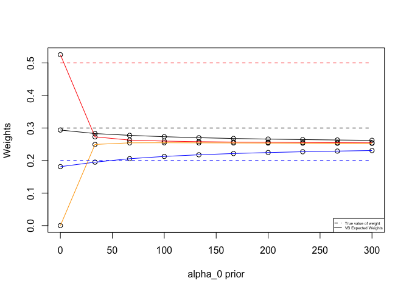<!-- -->

## Influence of other hyper-parameters

### Influence of $\nu_{0}$

In the same way we vary $\nu_0$ to see its impact on the estimations. We fix our alpha to $0.1$.


```r
nu0_<-seq(0.1, 200, length.out=15)
p_vb_nu<-matrix(0,ncol= Kfit, nrow= length(nu0_))

seed <- 10
for (i in 1:length(nu0_)){
  set.seed(seed)
  outputvb_test <- vbalgo(x=X,k=Kfit, alpha0 = alpha0, 
                          W0inv = solve(W0), nu0 = nu0_[i], m0 = m0, 
                          beta0=beta0, tol=1e-6)
  T <- ncol(outputvb_test$alphamat)
  p_vb_nu[i,] <- outputvb_test$alphamat[,T] / sum(outputvb_test$alphamat[,T])
}

results = NULL
for (i in 1:Kfit){
  local = cbind(p_vb_nu[,i],nu0_)
  results <- rbind(results, local)
}

plot(results[,2],results[,1],ylim= range(p_vb_nu[1,],p),xlab = "nu0_ prior",
     ylab = "Weights")
legend("bottomright", c("True value of weight", "VB Expected Weights") ,
       col = c("black", "black"),lty = c(2,1), pch = c(NA,NA),cex = 0.4)

## To modifiy if we change Kfit
lines(nu0_,p_vb_nu[,1],type="l",col = 'red')
lines(nu0_,p_vb_nu[,2],type="l" ,col = 'blue')
lines(nu0_,p_vb_nu[,3],type="l" , col = 'black')
lines(nu0_,p_vb_nu[,4],type="l", col = 'orange')
lines(nu0_,rep(p[1],nrow(p_vb_nu)),col='black',lty=2)
lines(nu0_,rep(p[2],nrow(p_vb_nu)),col='blue',lty=2)
lines(nu0_,rep(p[3],nrow(p_vb_nu)),col='red',lty=2)
```

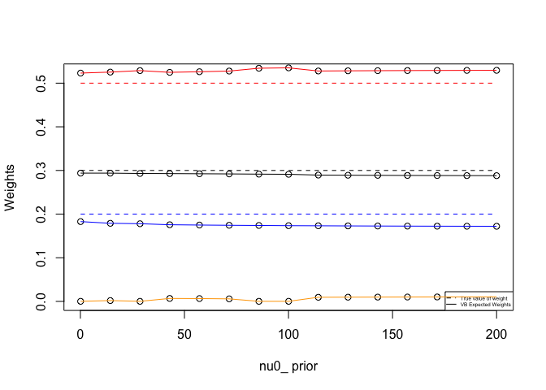<!-- -->

We see that the estimated weights are not influenced by $\nu$. 

### Influence of $W_{0}$


```r
Id = rbind(c(0,1),c(1,0))
Correl_list<-seq(0.1, 0.9, length.out=10)

# Creat a set of matrices
W0_ <- array(dim = c(2,2,length(Correl_list)))
for(j in 1:length(Correl_list)){
    W0_[,,j] <- W0 + Correl_list[j]*Id
}  

p_vb_W0<-matrix(0,ncol= Kfit, nrow= length(Correl_list))

seed <- 10
for (i in 1:length(Correl_list)){
  set.seed(seed)
  outputvb_test <- vbalgo(x=X,k=Kfit, alpha0 = alpha0, 
                          W0inv = solve(W0_[,,i]), nu0 = nu0, m0 = m0, 
                          beta0=beta0, tol=1e-6)
  T <- ncol(outputvb_test$alphamat)
  p_vb_W0[i,] <- outputvb_test$alphamat[,T] / sum(outputvb_test$alphamat[,T])
}

results = NULL
for (i in 1:Kfit){
  local = cbind(p_vb_W0[,i],Correl_list)
  results <- rbind(results, local)
}

plot(results[,2],results[,1],ylim= range(p_vb_W0[1,],p),xlab = "Correl in W0 prior",ylab = "Weights")
legend("bottomright", c("True value of weight", "VB Expected Weights") ,col = c("black", "black"),lty = c(2,1), pch = c(NA,NA),cex = 0.4)

## To modifiy if we change Kfit
lines(Correl_list,p_vb_W0[,1],type="l",col = 'red')
lines(Correl_list,p_vb_W0[,2],type="l" ,col = 'blue')
lines(Correl_list,p_vb_W0[,3],type="l" , col = 'black')
lines(Correl_list,p_vb_W0[,4],type="l", col = 'orange')
lines(Correl_list,rep(p[1],nrow(p_vb_W0)),col='black',lty=2)
lines(Correl_list,rep(p[2],nrow(p_vb_W0)),col='blue',lty=2)
lines(Correl_list,rep(p[3],nrow(p_vb_W0)),col='red',lty=2)
```

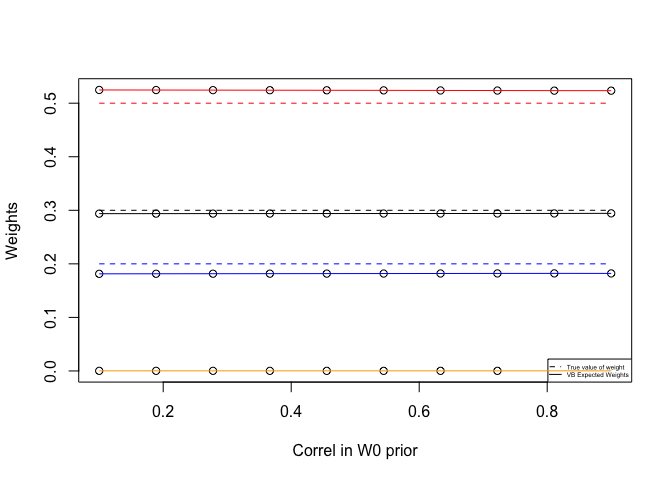<!-- -->

So changing $W_0$ does not have a big impact on estimating the weights, but it could impact outher estimated parameters.

From all of that, we can conclude that the most important hyper-parameter is $\alpha_0$.

# Part 3 Metropolis-Hastings algorithm

## Proposal kernel - MH algortihm

In this part we will implement a Metropolis-Hastings algorithm for sampling the posterior distribution in the model described in the previous section (VB).

To generate a proposal $\theta=(\rho_{1:k},\mu_{1:k},\Sigma_{1:k})$ from a current parameter $\theta^{t}=(\rho^{t}_{1:k},\mu^{t}_{1:k},\Sigma^{t}_{1:k})$ we use the following kernel (To simplify notations we ommit the indice $j \in {1:k}$):


$$
\mathcal{Q}_{\alpha_{p},\sigma_{p},\nu_{\Sigma}}(\theta^{t}, \theta)=\mathcal{D}iri(\rho| \alpha_{p}\times \alpha^{t})\mathcal{N}(\mu|\mu^{t},\sigma_{p}I_{d})\mathcal{W}ishart(\Sigma|\nu_{\Sigma},(\nu_{\Sigma})^{-1}\Sigma^{t})
$$


This allows us to define the acceptance probability as follows:

$$ Acceptance(\theta^{t},\theta)=min(1,\frac{\tilde{p}(\theta)\mathcal{Q}(\theta,\theta^{t})}{\tilde{p}(\theta^{t})\mathcal{Q}(\theta^{t},\theta)})
$$

We know that the gaussian distribution is symetric, so we can right the fraction without taking it into account.

$$
min(1,\frac{\tilde{p}(\theta)\mathcal{Q}(\theta,\theta^{t})}{\tilde{p}(\theta^{t})\mathcal{Q}(\theta^{t},\theta)})=min(1, \frac{\tilde{p}(\theta)\mathcal{D}iri(\rho| \alpha_{p}\times \alpha)\mathcal{W}ishart(\Sigma^{t}|\nu_{\Sigma},(\nu_{\Sigma})^{-1}\Sigma)}{\tilde{p}(\theta^{t})\mathcal{D}iri(\rho| \alpha_{p}\times \alpha^{t})\mathcal{W}ishart(\Sigma|\nu_{\Sigma},(\nu_{\Sigma})^{-1}\Sigma^{t})})
$$

To remember the fraction easly one can understand it as $\mathbb{P}$(going back)/$\mathbb{P}$(going to proposal).

This allows us to implement the rproposal function (the kernel) and complete the MH-algorithm.

## Testing MH-algorithm

We test our algorithm using the following code.


```r
####################################################'
####' Metropolis-Hastings
####################################################'
#' Basic testing for the MH sampler
Kmc <- Kfit ## try with different values
init <- initem(x=X, k=Kmc)

hpar <- list( alpha0=rep(alpha0, Kmc),
           m0 = rep(0, d), beta0 = beta0, 
           W0 = W0, nu0 = nu0)

ppar <- list(var_Mu = 0.001,
            nu_Sigma = 500,
            alpha_p = 500) 


set.seed(1)
pct <- proc.time()
outputmh <- MHsample(x=X, k=Kmc, nsample= 3000,
                    init=init, hpar=hpar, ppar=ppar)
newpct <- proc.time()
elapsed <- newpct - pct
elapsed
```

```
##    user  system elapsed 
##  16.173   0.037  16.244
```

```r
outputmh$naccept ## should not be ridiculously low. 
```

```
## [1] 429
```

## Convergence diagnostics:


Usually in the MCMC, to study the convergence we plot the evolution of the parameters at every iteration. In our case tracing the evolution of a single parameter is not relevant because of re-labelling. It means that at every step the simulated parameter could repesent the estimated value of a certain cluster. As a solution to this problem we suggest to a new relevant numerical summary and following the evolution of the cumulative distribution function (CDF) at a given point $x = (x_1,...,x_d)$ is a good choice:
$$
F(y|\rho^t,\mu^t,\Sigma^t) = \mathbb{P}(x_1 \leq y_1,...,x_d  \leq  y_d |\rho^t,\mu^t,\Sigma^t)
$$
for $t \in {1,...,N_{simple}}$

This can be calculated easly using the simulated parameters $\theta^t$ and the multivariate cumulative distribution function in a GMM *gmcdf*. At iteration number $t$ it is equal to $gmcdf(x,\theta^t)$.Using that, we implement the function $cdfTrace$ that returns such a time series. For accuracy, we use a burnin to not take into account the first simulated points.


```r
# We choose a sample of X

simple_size = 3
X_simple = cbind(X[1,],X[20,],X[400,]) #
y = NULL
for (i in 1:simple_size){
  y = cbind(y,cdfTrace(X_simple[,i],outputmh,burnin = 600))  
  #  BURNIN Delete first points that does not give a meaning about Nsample/5
}

plot(y[,1], type="l", col = 'red', main="Evolution of CFD of 3 different x" , ylim =  range(y), ylab = "interations", xlab = "CFD") 
lines(y[,2], col = 'blue')
lines(y[,3], col = 'black')
```

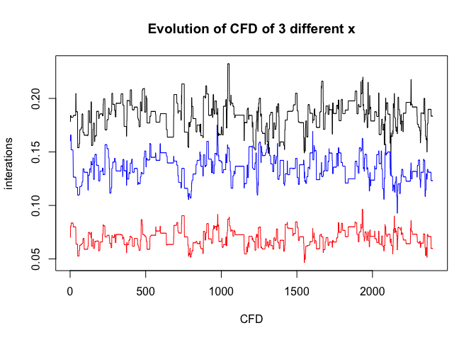<!-- -->

### Heidelberger and Welch’s test

The heidelberger test give an idea about the stationarity of the simulated distribution.
One could say that the simulated distribution converges if the stationarity hypothesis on the simulated cumulative distribution is true for every x.


```r
# Get the mcmc series from previous simulated CFD for 3 different x
y1 <- mcmc(y[,1])
y2 <- mcmc(y[,2])
y3 <- mcmc(y[,3])
# Get a summary and plot the simulated CFD for one x
summary(y1)
```

```
## 
## Iterations = 1:2400
## Thinning interval = 1 
## Number of chains = 1 
## Sample size per chain = 2400 
## 
## 1. Empirical mean and standard deviation for each variable,
##    plus standard error of the mean:
## 
##           Mean             SD       Naive SE Time-series SE 
##      0.0696790      0.0076126      0.0001554      0.0008846 
## 
## 2. Quantiles for each variable:
## 
##    2.5%     25%     50%     75%   97.5% 
## 0.05513 0.06406 0.07013 0.07410 0.08412
```

```r
plot(y1)
```

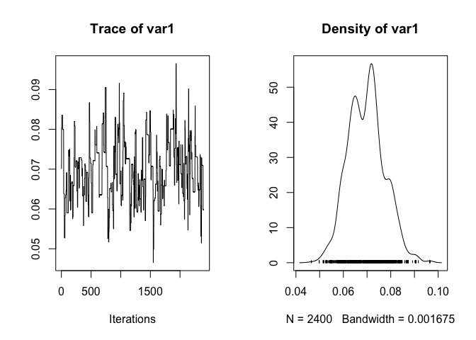<!-- -->

```r
# Run Heidel tests
heidel.diag(y1, eps=0.1, pvalue=0.05)
```

```
##                                    
##      Stationarity start     p-value
##      test         iteration        
## var1 passed       1         0.755  
##                                
##      Halfwidth Mean   Halfwidth
##      test                      
## var1 passed    0.0697 0.00173
```

```r
heidel.diag(y2, eps=0.1, pvalue=0.05)
```

```
##                                    
##      Stationarity start     p-value
##      test         iteration        
## var1 passed       1         0.298  
##                               
##      Halfwidth Mean  Halfwidth
##      test                     
## var1 passed    0.135 0.00276
```

```r
heidel.diag(y3, eps=0.1, pvalue=0.05)
```

```
##                                    
##      Stationarity start     p-value
##      test         iteration        
## var1 passed       1         0.644  
##                               
##      Halfwidth Mean  Halfwidth
##      test                     
## var1 passed    0.184 0.00282
```

We can get better results and be sure of the stability of the simulated markov chain. We set $N_{sample}$ to 4000 we re-run the MH algorithm and tests.


```r
Kmc <- Kfit ## try with different values
init <- initem(x=X, k=Kmc)

hpar <- list( alpha0=rep(alpha0, Kmc),
           m0 = rep(0, d), beta0 = beta0, 
           W0 = W0, nu0 = nu0)

ppar <- list(var_Mu = 0.001,
            nu_Sigma = 500,
            alpha_p = 500) 


set.seed(1)
pct <- proc.time()
outputmh <- MHsample(x=X, k=Kmc, nsample= 4000,
                    init=init, hpar=hpar, ppar=ppar)
newpct <- proc.time()
elapsed <- newpct - pct
elapsed
```

```
##    user  system elapsed 
##  40.766   0.360  45.453
```

```r
outputmh$naccept
```

```
## [1] 402
```

```r
##### Heidel tests

simple_size = 3
X_simple = cbind(X[1,],X[20,],X[400,]) #
y = NULL
for (i in 1:simple_size){
  y = cbind(y,cdfTrace(X_simple[,i],outputmh,burnin = 800))  
  #  BURNIN Delete first points that does not give a meaning about Nsample/5
}

# Get the mcmc series from previous simulated CFD for 3 different x
y1 <- mcmc(y[,1])
y2 <- mcmc(y[,2])
y3 <- mcmc(y[,3])

# Run Heidel tests
heidel.diag(y1, eps=0.1, pvalue=0.05)
```

```
##                                    
##      Stationarity start     p-value
##      test         iteration        
## var1 passed       1         0.135  
##                                
##      Halfwidth Mean   Halfwidth
##      test                      
## var1 passed    0.0713 0.00406
```

```r
heidel.diag(y2, eps=0.1, pvalue=0.05)
```

```
##                                    
##      Stationarity start     p-value
##      test         iteration        
## var1 passed       1         0.141  
##                               
##      Halfwidth Mean  Halfwidth
##      test                     
## var1 passed    0.129 0.00514
```

```r
heidel.diag(y3, eps=0.1, pvalue=0.05)
```

```
##                                    
##      Stationarity start     p-value
##      test         iteration        
## var1 passed       1         0.155  
##                               
##      Halfwidth Mean  Halfwidth
##      test                     
## var1 passed    0.186 0.00509
```


The heidel test is passed for x we choosed and it should insure the stability for all other x's.

**- A Method to propose a reasonable number of iterations**

To propose a reasonable number of iterations, the Heidel test should be passed for every x in the initial data. So we need to to have a number of simulation that allow us to insure **stationarity**.
A simple method to get the number of simulation consist of calculating the ratio between the half-width and the mean (calculated in the heidel test). If this ratio is lower than eps, the tested is passed and we are above the necessary number of simulation. Otherwise the length of the sample is deemed not long enough to estimate the mean with sufficient accuracy.

We plot the evolution of Halfwidth/mean at every iteration.


```r
# For the MCMC y (calculated before)
# We plot the evolution of Halfwidth/Mean
eps=0.1
pvalue=0.05

res <- numeric(length(y1))
for (i in 100:length(y1)){
  heidal = heidel.diag(y1[1:i], eps=eps, pvalue=pvalue)
  res[i] <- heidal[6]/heidal[5]
}
plot(res, type = 'l', main="Evolution of Halfwidth/Mean for a specefic x",
     xlab = "Iterations (after burnin)", ylab ="ratio")
lines(rep(eps,length(y1)),col='green')
```

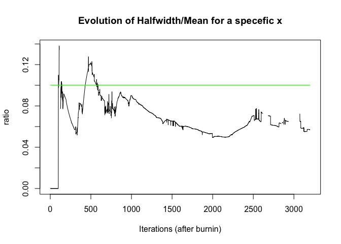<!-- -->

As a conclusion we need to take a number of iterations that insure that the Heidel test is passed for every x (in other words, the ration is under eps 'the green line').

### Gelman and Rubin’s diagnostic

Another way to analyse the convergence is the Gelman and Rubin’s diagnostic.
To apply this method, we need to simulate a list of MCMCs. To do so, firstly we simulate three different chains outputmh1,outputmh2, outputmh3 with different starting values.


```r
# Simulate three different chains with different starting points

#'vary the initial point
alpha0_<-c(0.3,0.5,0.9)
m0_<-rbind(c(1,1),c(2,2),c(1,-1))
beta0_<-c(0.2,1,2)
W0_<-abind(2*diag(2), diag(c(1,3)), diag(c(3,1)), along =3)


hpar_1 <- list( alpha0=rep(alpha0_[1], Kmc),
               m0 = m0_[1], beta0 = beta0_[1], 
               W0 = W0_[,,1], nu0 = nu0)
hpar_2 <- list( alpha0=rep(alpha0_[2], Kmc),
               m0 = m0_[2], beta0 = beta0_[2], 
               W0 = W0_[,,2], nu0 = nu0)
hpar_3 <- list( alpha0=rep(alpha0_[3], Kmc),
               m0 = m0_[3], beta0 = beta0_[3], 
               W0 = W0_[,,3], nu0 = nu0)

nsample = 4000

outputmh1 <- MHsample(x=X, k=Kmc, nsample= nsample,
                      init=init, hpar=hpar_1, ppar=ppar)
outputmh2 <- MHsample(x=X, k=Kmc, nsample= nsample,
                      init=init, hpar=hpar_2, ppar=ppar)
outputmh3 <- MHsample(x=X, k=Kmc, nsample= nsample,
                      init=init, hpar=hpar_3, ppar=ppar)
# We choose an x, we take the mean of X

x_test = c(mean(X[,1]),mean(X[,2]))

# Get the CFD simulated by each chain for this x_test
outputmh_all <- list(outputmh, outputmh1,outputmh2,outputmh3)

cfd_x = NULL
for (chain in (outputmh_all)){
  cfd_x = cbind(cfd_x,cdfTrace(x_test,chain,burnin = 800))  
}

plot(cfd_x[,1],type="l", main = "Evolution of CFD of x from different chains")
lines(cfd_x[,2],type="l",col='blue')
lines(cfd_x[,3],type="l",col='red')
lines(cfd_x[,4],type="l",col='purple')
```

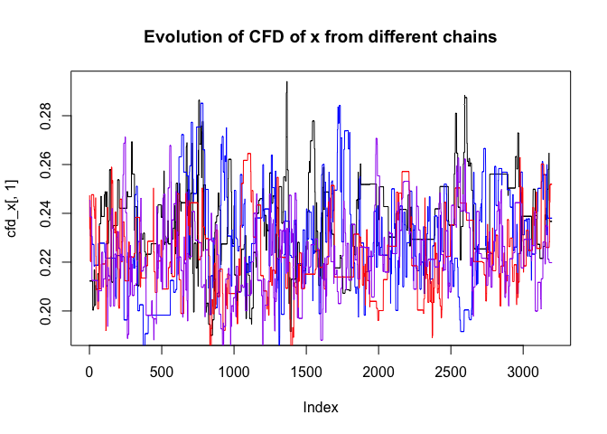<!-- -->

Then we could run the Gelman test:


```r
# We get the simulated MCMC chains for our specefic x

chain_1 = mcmc(cfd_x[,1])
chain_2 = mcmc(cfd_x[,2])
chain_3 = mcmc(cfd_x[,3])
chain_4 = mcmc(cfd_x[,4])
# Get list of chains

Y <- mcmc.list(chain_1,chain_2,chain_3,chain_4)

#run gelman

gelman.diag(Y)
```

```
## Potential scale reduction factors:
## 
##      Point est. Upper C.I.
## [1,]       1.13       1.35
```

```r
gelman.plot(Y)
```

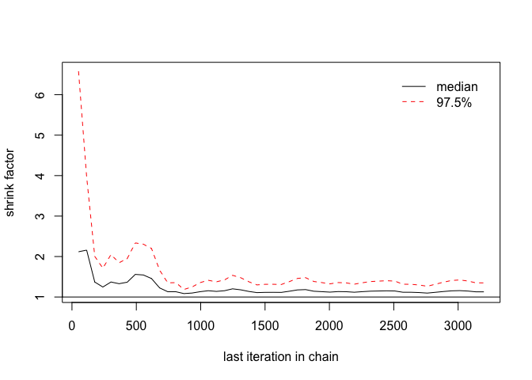<!-- -->

In order to minimize the upper limit to 1 (to insure the converegence following the Gelman and Rubin's test) we augment the number of simulations to n_sample = 5000:


```r
# Nb sample

nsample = 5000

# Run multiple chains

outputmh_0 <- MHsample(x=X, k=Kmc, nsample= nsample,
                    init=init, hpar=hpar, ppar=ppar)
outputmh1 <- MHsample(x=X, k=Kmc, nsample= nsample,
                      init=init, hpar=hpar_1, ppar=ppar)
outputmh2 <- MHsample(x=X, k=Kmc, nsample= nsample,
                      init=init, hpar=hpar_2, ppar=ppar)
outputmh3 <- MHsample(x=X, k=Kmc, nsample= nsample,
                      init=init, hpar=hpar_3, ppar=ppar)

##
outputmh_all <- list(outputmh_0, outputmh1,outputmh2,outputmh3)

cfd_x = NULL
for (chain in (outputmh_all)){
  cfd_x = cbind(cfd_x,cdfTrace(x_test,chain,burnin = 1000))  #  BURNIN Delete first points that does not give a meaning
}

chain_1 = mcmc(cfd_x[,1])
chain_2 = mcmc(cfd_x[,2])
chain_3 = mcmc(cfd_x[,3])
chain_4 = mcmc(cfd_x[,4])
# Get list of chains

Y <- mcmc.list(chain_1,chain_2,chain_3,chain_4)

# Run Heideil

heidel.diag(chain_1, eps=0.1, pvalue=0.05)
```

```
##                                    
##      Stationarity start     p-value
##      test         iteration        
## var1 passed       1         0.643  
##                               
##      Halfwidth Mean  Halfwidth
##      test                     
## var1 passed    0.241 0.003
```

```r
heidel.diag(chain_2, eps=0.1, pvalue=0.05)
```

```
##                                    
##      Stationarity start     p-value
##      test         iteration        
## var1 passed       1         0.405  
##                               
##      Halfwidth Mean  Halfwidth
##      test                     
## var1 passed    0.235 0.00389
```

```r
heidel.diag(chain_3, eps=0.1, pvalue=0.05)
```

```
##                                    
##      Stationarity start     p-value
##      test         iteration        
## var1 passed       1         0.315  
##                               
##      Halfwidth Mean  Halfwidth
##      test                     
## var1 passed    0.225 0.00388
```

```r
heidel.diag(chain_4, eps=0.1, pvalue=0.05)
```

```
##                                    
##      Stationarity start     p-value
##      test         iteration        
## var1 passed       401       0.261  
##                               
##      Halfwidth Mean  Halfwidth
##      test                     
## var1 passed    0.226 0.00393
```

```r
# Run Gelman test

gelman.diag(Y)
```

```
## Potential scale reduction factors:
## 
##      Point est. Upper C.I.
## [1,]        1.1       1.27
```

```r
gelman.plot(Y)
```

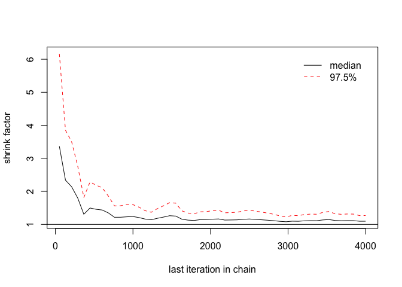<!-- -->

**- Conclusion:** 

In the Gelman and Rubin's test, approximate convergence is diagnosed when the upper limit is close to 1. It is the case in our simulations.
So we conclude that with $N_{sample} = 5000$ there is a good convergence into the simulated law.


## Predictive density

The goal of this question is to plot the numerical approximation of the predictive density, which is given by the MH sample as

$$
\hat{f}_{MH}(y) = \frac{1}{M}\sum_{t=1}^{M}{f(y|\rho^t,\mu^t,\Sigma^t)} 
$$
Where M is the number of remaining samples after discarding the burn-in period and thinning.
We know that $log(f(y|\rho^t,\mu^t,\Sigma^t))$ correspoand to the Log-likelihood in the Gaussian mixture model which can be calculated using *gmllk* and the simulated parameter given by MH. Then, to get  $\hat{f}_{MH}$ we take the mean over the exponential of Log-likelihood. This allows us to complete the *MHpredictive* function that returns $\hat{f}_{MH}$

We plot the desired result together with the true density using the following code:


```r
#' Predictive density

xx <- seq(-2,2,length.out=20)
yy <- xx
dtrue <- outer(X= xx, Y=yy,
            FUN = function(x,y){
                wrapper(x=x, y=y,
                        FUN=function(u,v){
                          exp(gmllk(x = c(u,v), Mu = Mu,
                          Sigma = Sigma, p = p))
                        })
            })

dpredmh <-  outer(X= xx, Y=yy,
            FUN = function(x,y){
                wrapper(x = x, y = y,
                        FUN =function(u,v){
                          MHpredictive(c(u,v),outputmh , burnin=1000, thin=1)}) 
            })

breaks <- c(seq(0.01,0.09, length.out=5),seq(0.1,0.3,length.out=5))
nbreaks <- length(breaks)
contour(xx,yy, z = dtrue, nlevels=nbreaks, levels = breaks)
contour(xx,yy, z = dpredmh,  nlevels=nbreaks, levels = breaks,
          add=TRUE, col='red')
```

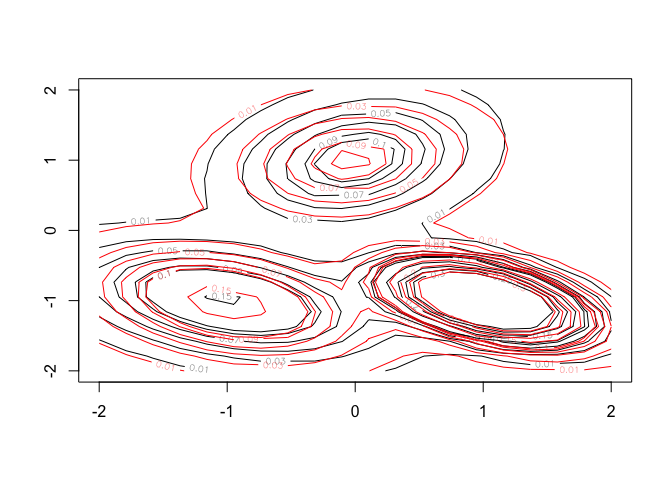<!-- -->

In black is the true density and in red is the estimated density using MH sample. One could see that we run our MH simulation without the need of prior informations on the data. For examle even when we set Kmc to 4, while the true K is 3, we still get a good approximation of the true density. The only downside of this estimation is the time taken to do computations (approx 8min on my computer).

# Part 5 - Predictive distributions versus maximum likelihood distribution

##  Numerical approximations of the probability of excess

In this part we want to estimate the probability of an excess of a threshold $u$ defined as:
$$
\phi(u,\rho,\mu_{1:k},\Sigma_{1:k}) = 1 - F(u|rho,\mu_{1:k},\Sigma_{1:k})
$$

Where F is the cdf for the Gaussian Mixture.

We will compare the performance of the estimators obtained by EM (maximum likelihood), Variational Bayes and Metropolis-Hastings to get a numerical approximation of $\phi$.

- **EM algorithm**

Let $(\hat{\rho},\hat{\mu}_{1:k},\hat{\Sigma}_{1:k})$ the estimation of the paramter given by the EM algortihm. Then an estimation of the  probability of an excess of a threshold $u$ is given by 
$$
\hat{\phi}_1(u) = \phi(u,\hat{\rho},\hat{\mu}_{1:k},\hat{\Sigma}_{1:k})
$$

$\hat{\phi_1(u)}$ is computed using *1 - gmcdf(argument)* and the output of EM as argument.

- **Variational Bayes**

It is known that the variational predictive distribution is a mixture of multivariate Student distributions with parameters that are functions of the optimized parameters $(\alpha^*, m^*_j , \beta_j^*, W_j^*, \nu_j^*), j \in {1, . . . , k}$ of the variational posterior distribution. 
$$
\hat{\phi}_2(u) = \mathbb{E}(\phi(u,\hat{\rho},\hat{\mu}_{1:k},\hat{\Sigma}_{1:k})) \text { with } \hat{\rho},\hat{\mu}_{1:k},\hat{\Sigma}_{1:k} \text{ Follows the posterior variational distribution}
$$

This is computed using the implemented function *vbPredictiveCdf*.

- **Metropolis-Hastings**

The third estimation is done using the results of the MH simulations.
One can estimate $\phi$ using:

$$
\hat{\phi}_{3}(u) = \frac{1}{M}\sum_{t=1}^{M}{\phi(y|\rho^t,\mu^t,\Sigma^t)} 
$$

Where M is the number of remaining samples after discarding the burn-in period and thinning and the simulated parameter at step $t$ is $(\rho^t,\mu^t,\Sigma^t)$. This can be computed using $gmcdf$ and $(\rho^t,\mu^t,\Sigma^t)$ as an argument and then we take the mean. This is implemented in *MHpredictiveCdf*.

## Tests

Since we know how to compute all these estimatores, we will plot the results of a range of thresholds using the following code:


```r
#########################'
##' predictive Cdf's
#########################'
T <- ncol(outputvb$alphamat)
options(warn=-1)

Pexcess <- rep(0,10)
Pexcess_em <- Pexcess; Pexcess_vb <- Pexcess; Pexcess_mh <- Pexcess
thres_vect <-  seq(-3, 3, length.out=30)
#thres_vect <- seq(1, 5, length.out=30)
for(i in seq_along(thres_vect)){
  threshold <- rep(thres_vect[i], 2)
  Pexcess[i] <- 1 - gmcdf(x = threshold, Mu = Mu, Sigma=Sigma, p=p)
  Pexcess_em[i] <-1 - gmcdf(x = threshold,Mu =outputem$last$Mu, 
                            Sigma = outputem$last$Sigma, outputem$last$p)  
  ## 1 - gmcdf avec paramètres de EM algo
                  ##maximum likelihood estimator using EM output
  Pexcess_vb[i] <- 1 -  vbPredictiveCdf(x = threshold,outputvb$alphamat[,T],outputvb$Betamat[,T],outputvb$Marray[,,T],
                                        outputvb$Winvarray[,,,T],outputvb$Numat[,T]) 
    ## posterior predictive  estimator using VB output: 
    ## use vbPredictiveCdf
    
  Pexcess_mh[i] <-  1 - MHpredictiveCdf(x = threshold,outputmh,burnin = 0, thin = 1)
    ## posterior predictive  estimator using MH output:
    ## use MHpredictiveCdf. 
}

ylim <- range(Pexcess, Pexcess_em,Pexcess_vb)
plot(thres_vect,Pexcess, ylim = ylim)
lines(thres_vect, Pexcess_vb, col='red')
lines(thres_vect, Pexcess_em, col='blue')
lines(thres_vect, Pexcess_mh, col='green')

legend("topright", c("True Probability of excess ", "VB estimation of prob of excess",
                     "EM estimation of prob of excess","MH estimation of prob of excess") ,
       col = c("black", "red", "blue",'green'),lty = c(NA, 1,1,1), 
       pch = c(1, NA,NA,NA),cex = 0.5)
```

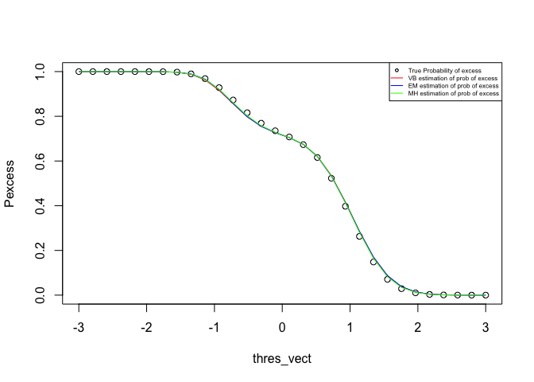<!-- -->

One could see that the estimation are roughly close and we cannot distniguish them by the eyes. Even thouht there is a small difference between them. 
Also this graph translate the intuition behind the probability of excess. When we are around -3 (the left of the graph), we are almost sur that we will exceed -3, so the probability around 1. While when we are close to 3, we are almost sure we will not exceed 3.

Now let's plot the same graph for a threshold between 1 and 5


```r
#########################'
##' predictive Cdf's
#########################'
T <- ncol(outputvb$alphamat)
options(warn=-1)

Pexcess <- rep(0,10)
Pexcess_em <- Pexcess; Pexcess_vb <- Pexcess; Pexcess_mh <- Pexcess
#thres_vect <-  seq(-3, 3, length.out=30)
thres_vect <- seq(1, 5, length.out=30)
for(i in seq_along(thres_vect)){
  threshold <- rep(thres_vect[i], 2)
  Pexcess[i] <- 1 - gmcdf(x = threshold, Mu = Mu, Sigma=Sigma, p=p)
  Pexcess_em[i] <-1 - gmcdf(x = threshold,Mu =outputem$last$Mu, Sigma = outputem$last$Sigma,
                            outputem$last$p)  ## 1 - gmcdf avec paramètres de EM algo
                  ##maximum likelihood estimator using EM output
  Pexcess_vb[i] <- 1 -  vbPredictiveCdf(x = threshold,outputvb$alphamat[,T],outputvb$Betamat[,T],outputvb$Marray[,,T],
                                        outputvb$Winvarray[,,,T],outputvb$Numat[,T]) 
    ## posterior predictive  estimator using VB output: 
    ## use vbPredictiveCdf
    
  Pexcess_mh[i] <-  1 - MHpredictiveCdf(x = threshold,outputmh,burnin = 0, thin = 1)
    ## posterior predictive  estimator using MH output:
    ## use MHpredictiveCdf. 
}

ylim <- range(Pexcess, Pexcess_em,Pexcess_vb)
plot(thres_vect,Pexcess, ylim = ylim)
lines(thres_vect, Pexcess_vb, col='red')
lines(thres_vect, Pexcess_em, col='blue')
lines(thres_vect, Pexcess_mh, col='green')

legend("topright", c("True Probability of excess ", "VB estimation of prob of excess",
                     "EM estimation of prob of excess","MH estimation of prob of excess") ,
       col = c("black", "red", "blue",'green'),lty = c(NA, 1,1,1),
       pch = c(1, NA,NA,NA),cex = 0.5)
```

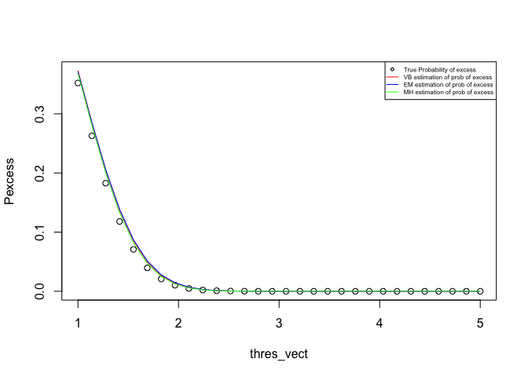<!-- -->

Here we show another inetresting fact about normal distributions. It is known that for a normal distibution, the majority of the simulated values are in [-3,3]. So the probability of excess of a bigger threshold will tend to 0.

**- Behavior of the Variational Bayes estimator**

An important behavior to see in when the prior is 'far' from the real distribution (for example we changed $m_0$ to $(50,50)$. We observe that the probability of excess we get by the VB is not a good approximation of the real one. So starting from an inapropriate prior could lead us to bad estimations.


```r
alpha0 <- 0.1
m0 <- c(50,50) # We change m0
beta0 <- 0.1
W0 <- 1*diag(2)
nu0 <- 10

#' Run VB 
#'
seed <- 10
set.seed(seed)
outputvb <- vbalgo(x=X,k=Kfit, alpha0 = alpha0, W0inv = solve(W0),
                 nu0 = nu0, m0 = m0, beta0=beta0, tol=1e-6)

T <- ncol(outputvb$alphamat)
options(warn=-1)

Pexcess <- rep(0,10)
Pexcess_em <- Pexcess; Pexcess_vb <- Pexcess; Pexcess_mh <- Pexcess
#thres_vect <-  seq(-3, 3, length.out=30)
thres_vect <- seq(1, 5, length.out=30)
for(i in seq_along(thres_vect)){
  threshold <- rep(thres_vect[i], 2)
  Pexcess[i] <- 1 - gmcdf(x = threshold, Mu = Mu, Sigma=Sigma, p=p)
  Pexcess_em[i] <-1 - gmcdf(x = threshold,Mu =outputem$last$Mu, Sigma = outputem$last$Sigma, outputem$last$p)  ## 1 - gmcdf avec paramètres de EM algo
                  ##maximum likelihood estimator using EM output
  Pexcess_vb[i] <- 1 -  vbPredictiveCdf(x = threshold,outputvb$alphamat[,T],outputvb$Betamat[,T],outputvb$Marray[,,T],
                                        outputvb$Winvarray[,,,T],outputvb$Numat[,T]) 
    ## posterior predictive  estimator using VB output: 
    ## use vbPredictiveCdf
    
  Pexcess_mh[i] <-  1 - MHpredictiveCdf(x = threshold,outputmh,burnin = 0, thin = 1)
    ## posterior predictive  estimator using MH output:
    ## use MHpredictiveCdf. 
}

ylim <- range(Pexcess, Pexcess_em,Pexcess_vb)
plot(thres_vect,Pexcess, ylim = ylim)
lines(thres_vect, Pexcess_vb, col='red')
lines(thres_vect, Pexcess_em, col='blue')
lines(thres_vect, Pexcess_mh, col='green')

legend("topright", c("True Probability of excess ", "VB estimation of prob of excess",
                     "EM estimation of prob of excess","MH estimation of prob of excess") ,
       col = c("black", "red", "blue",'green'),lty = c(NA, 1,1,1), 
       pch = c(1, NA,NA,NA),cex = 0.5)
```

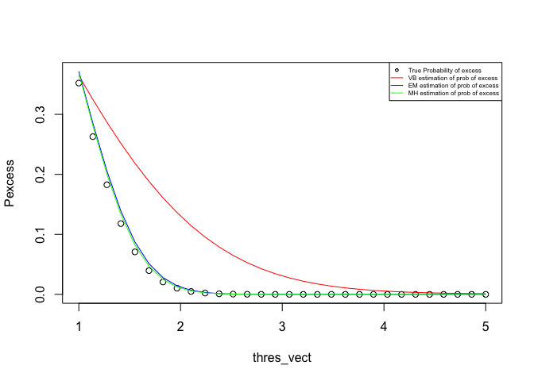<!-- -->


## 90% credible sets obtained with MH

We will focus now on $\hat{\phi}_3$ the estimation of the probability of the excess using MH algorithm.
We will plot $\hat{\phi}_3$ and the exact $\hat{\phi}$ together with posterior 90% credible sets obtained with the empirical quantiles of the time series $\hat{\phi}_3 = \phi((x,x)|\rho^t,\mu^t,\Sigma^t)$ for $t \in {1, . . . , M}$.

We use the following code to do so :


```r
Pexcess <- rep(0,10)
Pexcess_em <- Pexcess;  Pexcess_mh <- Pexcess

# local parameteres
a <- NULL
res <- NULL
# the variables will contains the quantiles
quantile1 <- Pexcess
quantile2 <- Pexcess

#thres_vect <-  seq(-3, 3, length.out=30)
thres_vect <- seq(1, 5, length.out=30)
for(i in seq_along(thres_vect)){
  threshold <- rep(thres_vect[i], 2)
  Pexcess[i] <- 1 - gmcdf(x = threshold, Mu = Mu, Sigma=Sigma, p=p)
  Pexcess_mh[i] <-  1 - MHpredictiveCdf(x = threshold,outputmh,burnin = 300, thin = 1)
  res <- 1 - cdfTrace(x = threshold,outputmh,burnin = 300, thin = 1)
  a <- quantile(x= res, probs = c(0.05, 0.95))
  quantile1[i] <- a[1]
  quantile2[i] <- a[2]
}

ylim <- range(Pexcess, Pexcess_mh)
plot(thres_vect,Pexcess, ylim = ylim, type = 'l')
lines(thres_vect, quantile1, col='red', lty = 2)
lines(thres_vect, quantile2, col='red',lty = 2)
lines(thres_vect, Pexcess_mh, col='green')
legend("topright", c("True Probability of excess", "MH estimation of prob of excess",
                     "credible sets") ,col = c("black", "green", "red"),lty = c(1,1,2),
       pch = c( NA,NA,NA),cex = 0.5)
```

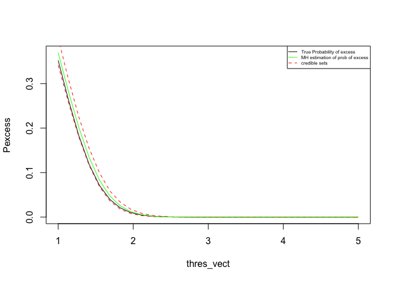<!-- -->


```r
Pexcess <- rep(0,10)
Pexcess_em <- Pexcess;  Pexcess_mh <- Pexcess

# local parameteres
a <- NULL
res <- NULL
# the variables will contains the quantiles
quantile1 <- Pexcess
quantile2 <- Pexcess

thres_vect <-  seq(-3, 3, length.out=30)
#thres_vect <- seq(1, 5, length.out=30)
for(i in seq_along(thres_vect)){
  threshold <- rep(thres_vect[i], 2)
  Pexcess[i] <- 1 - gmcdf(x = threshold, Mu = Mu, Sigma=Sigma, p=p)
  Pexcess_mh[i] <-  1 - MHpredictiveCdf(x = threshold,outputmh,burnin = 300, thin = 1)
  res <- 1 - cdfTrace(x = threshold,outputmh,burnin = 300, thin = 1)
  a <- quantile(x= res, probs = c(0.05, 0.95))
  quantile1[i] <- a[1]
  quantile2[i] <- a[2]
}

ylim <- range(Pexcess, Pexcess_mh)
plot(thres_vect,Pexcess, ylim = ylim, type = 'l')
lines(thres_vect, quantile1, col='red', lty = 2)
lines(thres_vect, quantile2, col='red',lty = 2)
lines(thres_vect, Pexcess_mh, col='green')
legend("topright", c("True Probability of excess", "MH estimation of prob of excess",
                     "credible sets") ,col = c("black", "green", "red"),lty = c(1,1,2),
       pch = c( NA,NA,NA),cex = 0.5)
```

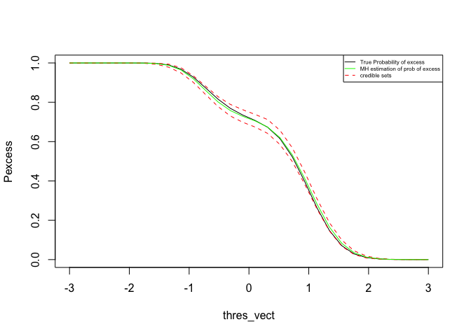<!-- -->

**Conclusion:**

We see that the real probability of excess is included in the credible sets obtained with empirical quantiles. 


# Conslusion

This Lab allowed us to see different implementation and compare the main computational methods studied in this class: EM, Variational Bayes and MCMC. We worked on an example of Gaussian mixture: given a dataset, the goal was to estimate the mixture distribution (clustering).

